# Recurrent Transformer 实现分析

本项目实现了一个递归Transformer架构，用于解决约束满足问题，特别是数独游戏。下面通过多个图表分析项目的核心实现细节。

## 模型架构

### 整体架构

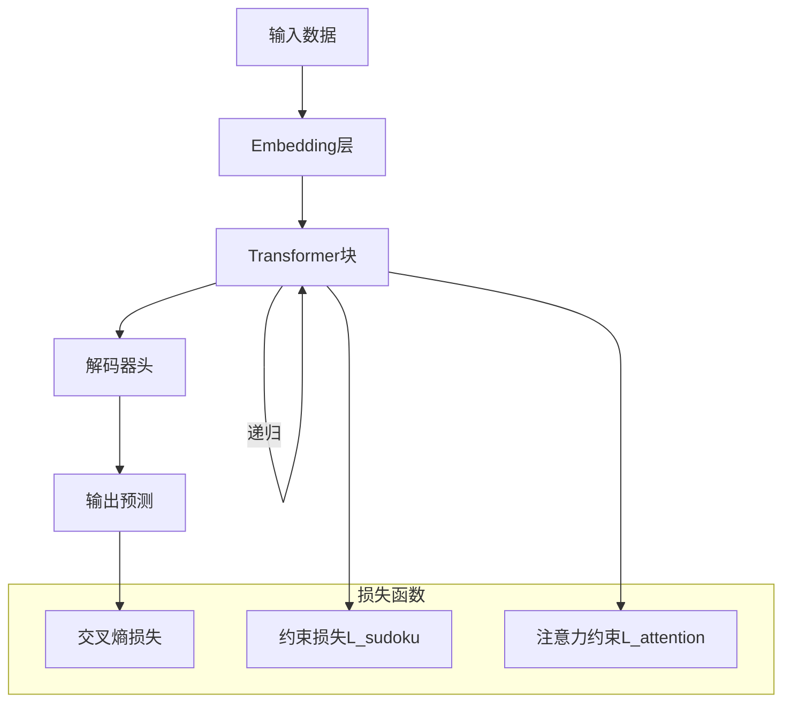
```mermaid
graph TD
    Input[输入数据] --> Embedding[Embedding层]
    Embedding --> Transformer[Transformer块]
    Transformer --> |递归|Transformer
    Transformer --> Decoder[解码器头]
    Decoder --> Output[输出预测]
    
    subgraph 损失函数
    CE[交叉熵损失]
    ConstraintLoss[约束损失L_sudoku]
    AttentionLoss[注意力约束L_attention]
    end
    
    Output --> CE
    Transformer --> ConstraintLoss
    Transformer --> AttentionLoss
```

### Overall Architecture (English)

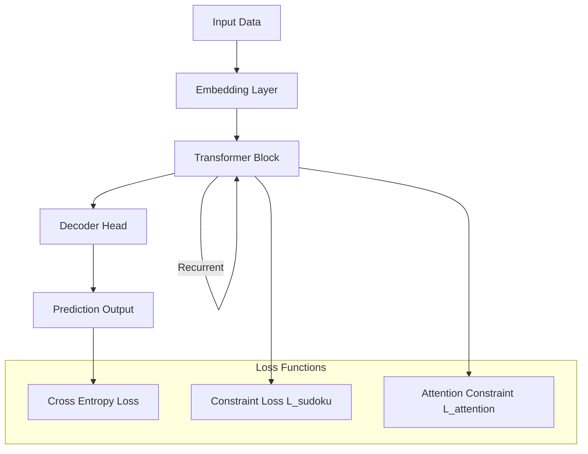
```mermaid
graph TD
    Input[Input Data] --> Embedding[Embedding Layer]
    Embedding --> Transformer[Transformer Block]
    Transformer --> |Recurrent|Transformer
    Transformer --> Decoder[Decoder Head]
    Decoder --> Output[Prediction Output]
    
    subgraph Loss Functions
    CE[Cross Entropy Loss]
    ConstraintLoss[Constraint Loss L_sudoku]
    AttentionLoss[Attention Constraint L_attention]
    end
    
    Output --> CE
    Transformer --> ConstraintLoss
    Transformer --> AttentionLoss
```

### Transformer块的详细结构

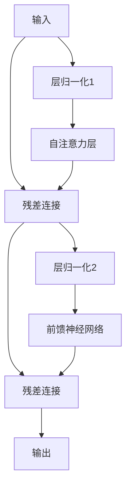
```mermaid
graph TD
    In[输入] --> LN1[层归一化1]
    LN1 --> Attention[自注意力层]
    In --> Add1[残差连接]
    Attention --> Add1
    Add1 --> LN2[层归一化2]
    LN2 --> MLP[前馈神经网络]
    Add1 --> Add2[残差连接]
    MLP --> Add2
    Add2 --> Out[输出]
```

### Transformer Block Structure (English)

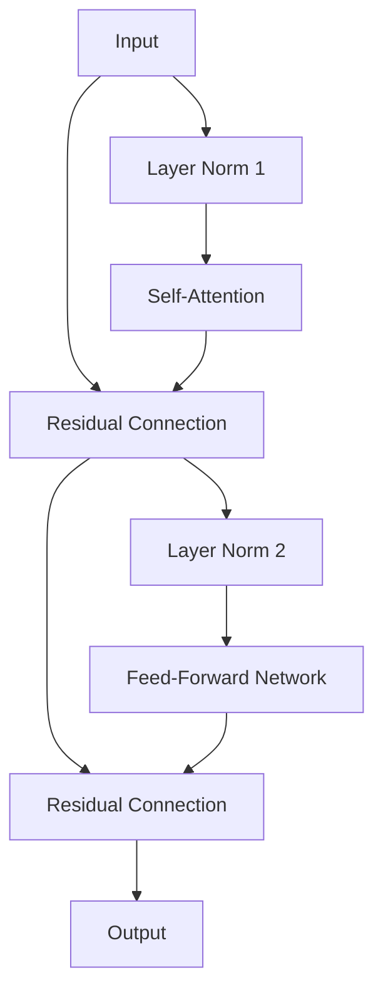
```mermaid
graph TD
    In[Input] --> LN1[Layer Norm 1]
    LN1 --> Attention[Self-Attention]
    In --> Add1[Residual Connection]
    Attention --> Add1
    Add1 --> LN2[Layer Norm 2]
    LN2 --> MLP[Feed-Forward Network]
    Add1 --> Add2[Residual Connection]
    MLP --> Add2
    Add2 --> Out[Output]
```

### 自注意力机制

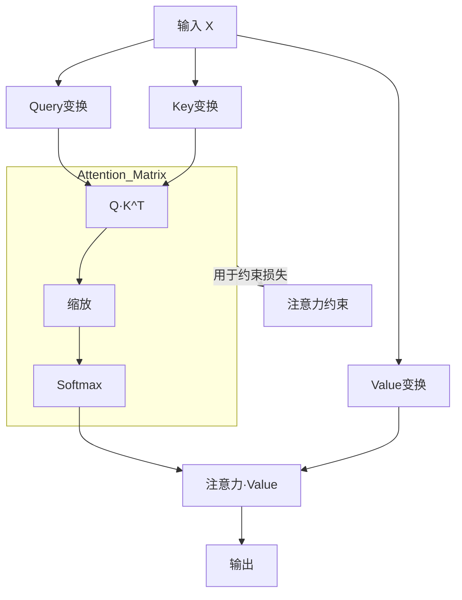
```mermaid
graph TD
    X[输入 X] --> Q[Query变换]
    X --> K[Key变换]
    X --> V[Value变换]
    Q --> QK[Q·K^T]
    K --> QK
    QK --> Scale[缩放]
    Scale --> SM[Softmax]
    SM --> AV[注意力·Value]
    V --> AV
    AV --> Out[输出]
    
    subgraph Attention_Matrix
    QK
    Scale
    SM
    end
    
    Attention_Matrix --> |用于约束损失| AttLoss[注意力约束]
```

### Self-Attention Mechanism (English)

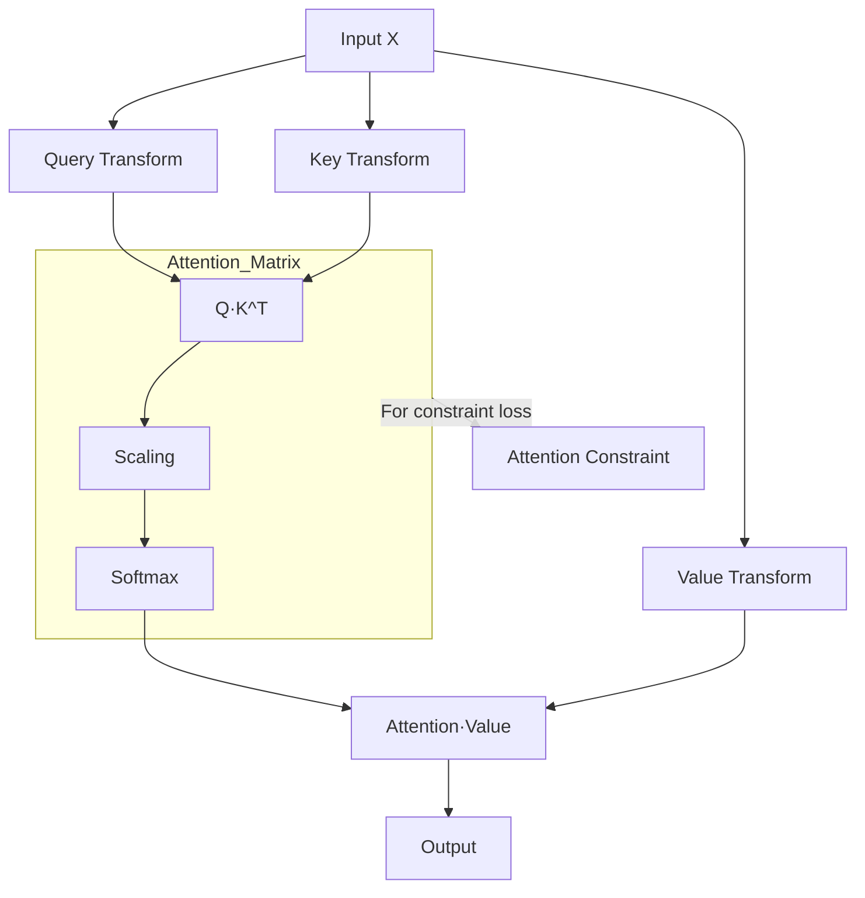
```mermaid
graph TD
    X[Input X] --> Q[Query Transform]
    X --> K[Key Transform]
    X --> V[Value Transform]
    Q --> QK[Q·K^T]
    K --> QK
    QK --> Scale[Scaling]
    Scale --> SM[Softmax]
    SM --> AV[Attention·Value]
    V --> AV
    AV --> Out[Output]
    
    subgraph Attention_Matrix
    QK
    Scale
    SM
    end
    
    Attention_Matrix --> |For constraint loss| AttLoss[Attention Constraint]
```

### 递归结构

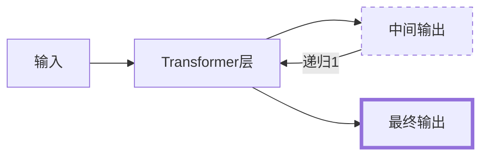
```mermaid
graph LR
    Input[输入] --> T1[Transformer层]
    T1 --> T1_out[中间输出]
    T1_out --> |递归1|T1
    T1 --> T1_final[最终输出]
    
    style T1_out stroke-dasharray: 5 5
    style T1_final stroke-width:4px
```

### Recurrent Structure (English)

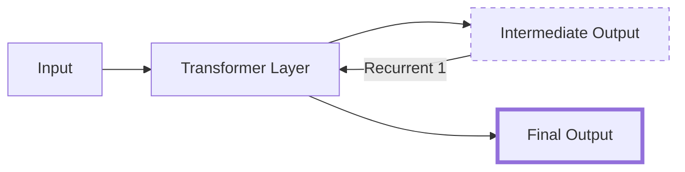
```mermaid
graph LR
    Input[Input] --> T1[Transformer Layer]
    T1 --> T1_out[Intermediate Output]
    T1_out --> |Recurrent 1|T1
    T1 --> T1_final[Final Output]
    
    style T1_out stroke-dasharray: 5 5
    style T1_final stroke-width:4px
```

## STE实现

### STE (Straight-Through Estimator) 原理

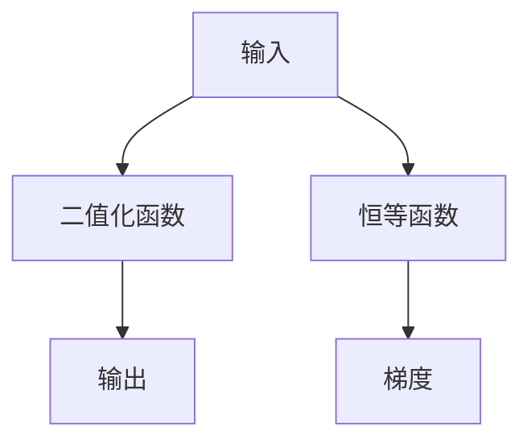
```mermaid
graph TD
    A[输入] --> B[二值化函数]
    B --> C[输出]
    A --> D[恒等函数]
    D --> E[梯度]
```

**说明：** 
- 上面的路径(A→B→C)代表前向传播，执行二值化操作
- 下面的路径(A→D→E)代表反向传播，直接传递梯度

### STE (Straight-Through Estimator) Principle (English)

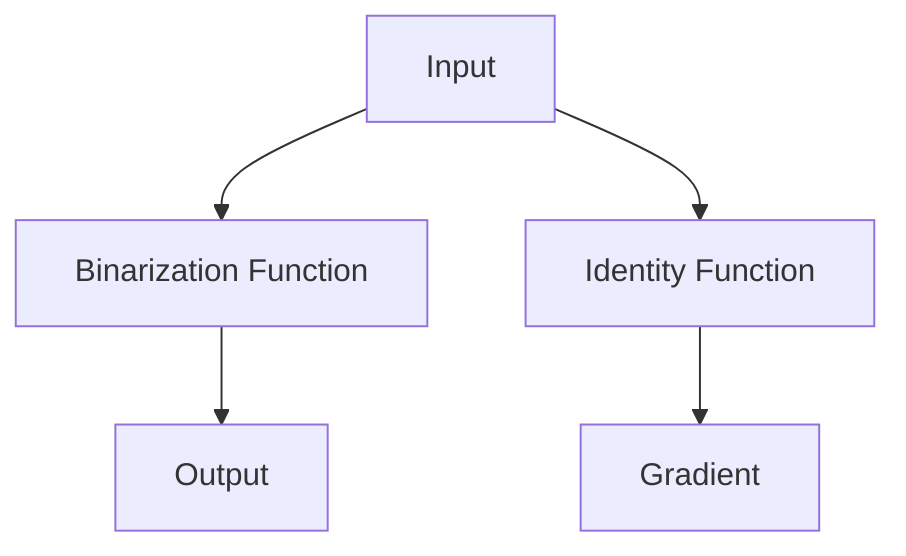
```mermaid
graph TD
    A[Input] --> B[Binarization Function]
    B --> C[Output]
    A --> D[Identity Function]
    D --> E[Gradient]
```

**Note:** 
- The upper path (A→B→C) represents forward propagation, performing binarization
- The lower path (A→D→E) represents backward propagation, directly passing gradients

### 二值化函数实现

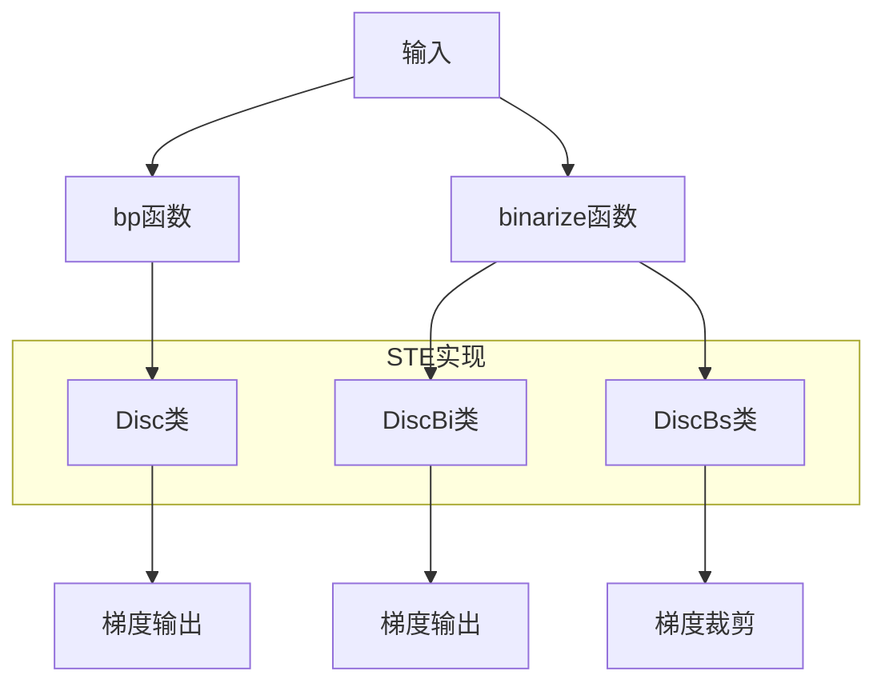
```mermaid
graph TD
    X[输入] --> BP[bp函数]
    X --> B[binarize函数]
    
    subgraph STE实现
    D1[Disc类]
    D2[DiscBi类]
    D3[DiscBs类]
    end
    
    BP --> D1
    B --> D2
    B --> D3
    
    D1 --> G1[梯度输出]
    D2 --> G2[梯度输出]
    D3 --> G3[梯度裁剪]
```

**说明：**
- bp函数: 当x≥0.5时输出1，否则输出0
- binarize函数: 当x≥0时输出1，否则输出-1
- 这三个类通过PyTorch的autograd.Function实现STE，在前向传播时执行离散操作，反向传播时保持梯度流动

### Binarization Function Implementation (English)

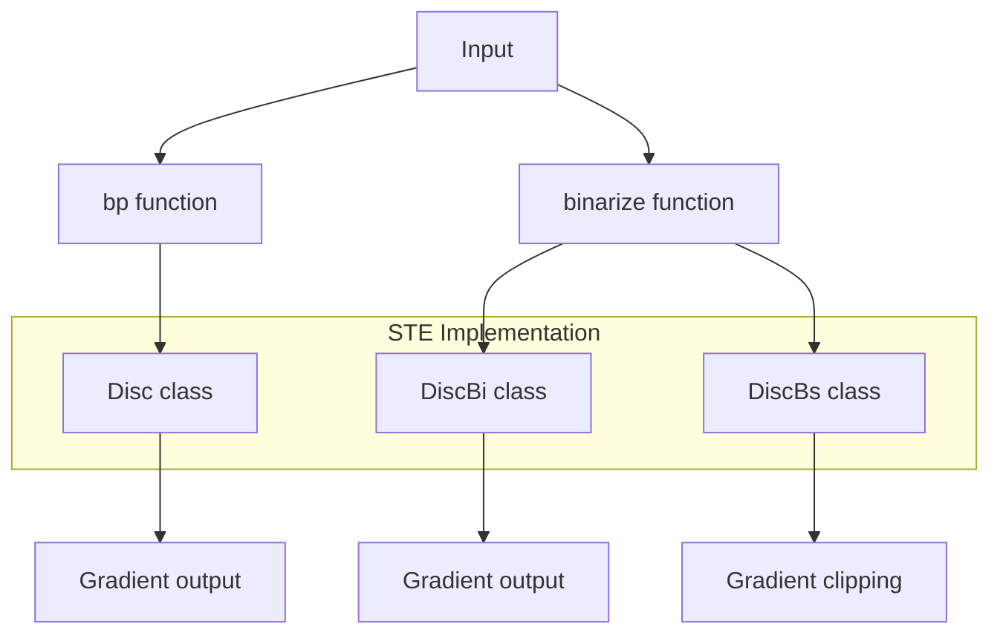
```mermaid
graph TD
    X[Input] --> BP[bp function]
    X --> B[binarize function]
    
    subgraph STE Implementation
    D1[Disc class]
    D2[DiscBi class]
    D3[DiscBs class]
    end
    
    BP --> D1
    B --> D2
    B --> D3
    
    D1 --> G1[Gradient output]
    D2 --> G2[Gradient output]
    D3 --> G3[Gradient clipping]
```

**Note:**
- bp function: outputs 1 if x≥0.5, otherwise 0
- binarize function: outputs 1 if x≥0, otherwise -1
- These three classes implement STE through PyTorch's autograd.Function, performing discrete operations in forward pass while maintaining gradient flow in backward pass

## 数据流

### 数据处理流程

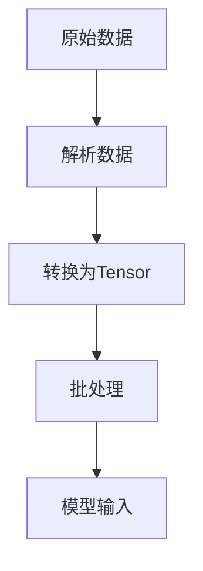
```mermaid
flowchart TD
    Data[原始数据] --> Parse[解析数据]
    Parse --> Tensor[转换为Tensor]
    Tensor --> BatchProcessing[批处理]
    BatchProcessing --> Model[模型输入]
```

### Data Processing Flow (English)

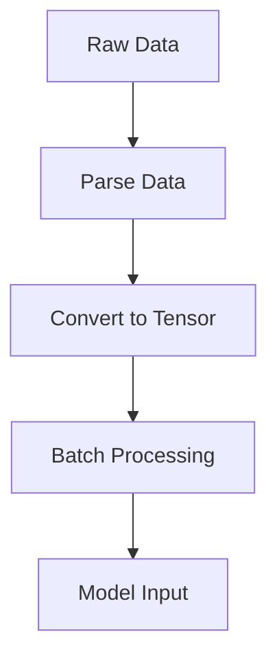
```mermaid
graph TD
    Data[Raw Data] --> Parse[Parse Data]
    Parse --> Tensor[Convert to Tensor]
    Tensor --> BatchProcessing[Batch Processing]
    BatchProcessing --> Model[Model Input]
```

### 数独数据表示

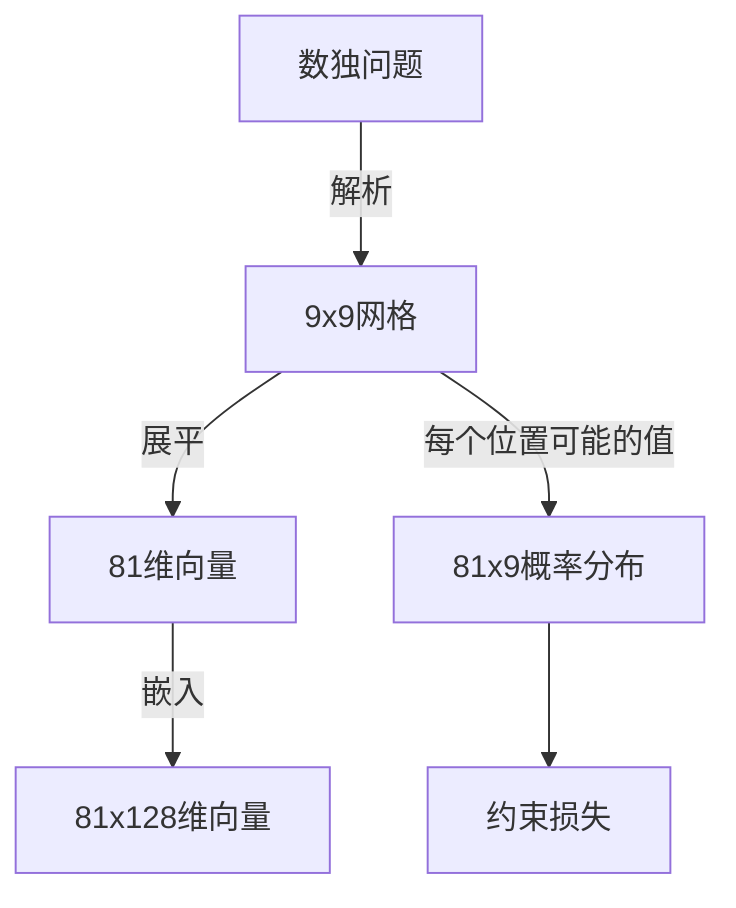
```mermaid
graph TD
    Sudoku[数独问题] --> |解析| Grid["9x9网格"]
    Grid --> |展平| Vector["81维向量"]
    Vector --> |嵌入| Embedding["81x128维向量"]
    
    Grid --> |每个位置可能的值| Probs["81x9概率分布"]
    Probs --> Loss["约束损失"]
```

### Sudoku Data Representation (English)

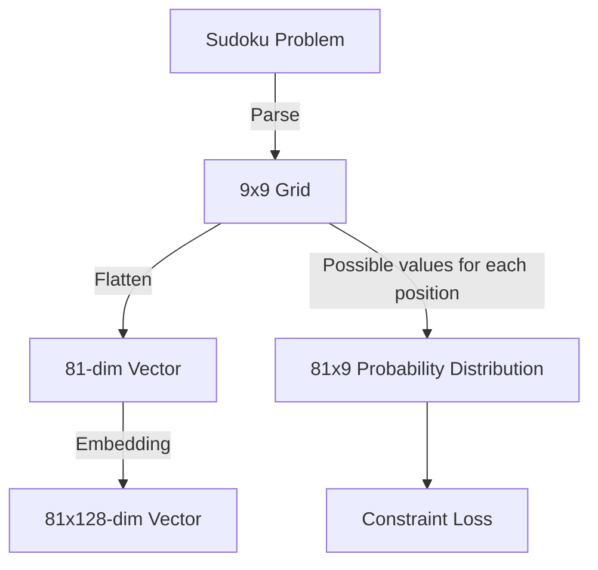
```mermaid
graph TD
    Sudoku[Sudoku Problem] --> |Parse| Grid["9x9 Grid"]
    Grid --> |Flatten| Vector["81-dim Vector"]
    Vector --> |Embedding| Embedding["81x128-dim Vector"]
    
    Grid --> |Possible values for each position| Probs["81x9 Probability Distribution"]
    Probs --> Loss["Constraint Loss"]
```

### 视觉数独处理流程

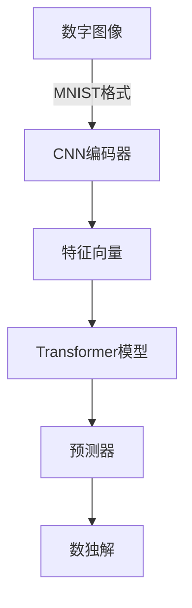
```mermaid
flowchart TD
    DigitImages[数字图像] --> |MNIST格式| CNN[CNN编码器]
    CNN --> Features[特征向量]
    Features --> Transformer[Transformer模型]
    Transformer --> Predictor[预测器]
    Predictor --> Solution[数独解]
```

### Visual Sudoku Processing Flow (English)

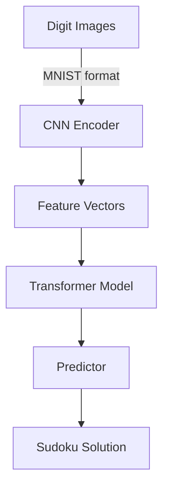
```mermaid
graph TD
    DigitImages[Digit Images] --> |MNIST format| CNN[CNN Encoder]
    CNN --> Features[Feature Vectors]
    Features --> Transformer[Transformer Model]
    Transformer --> Predictor[Predictor]
    Predictor --> Solution[Sudoku Solution]
```

### 训练数据流程

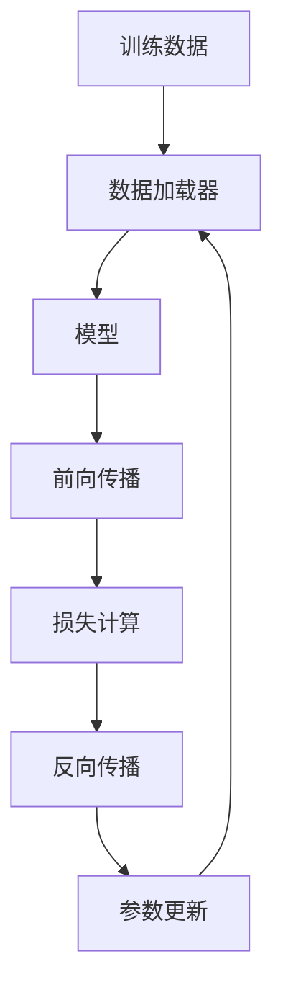
```mermaid
flowchart TD
    Train[训练数据] --> DataLoader[数据加载器]
    DataLoader --> Model[模型]
    Model --> Forward[前向传播]
    Forward --> Loss[损失计算]
    Loss --> Backward[反向传播]
    Backward --> Update[参数更新]
    Update --> DataLoader
```

### Training Data Flow (English)

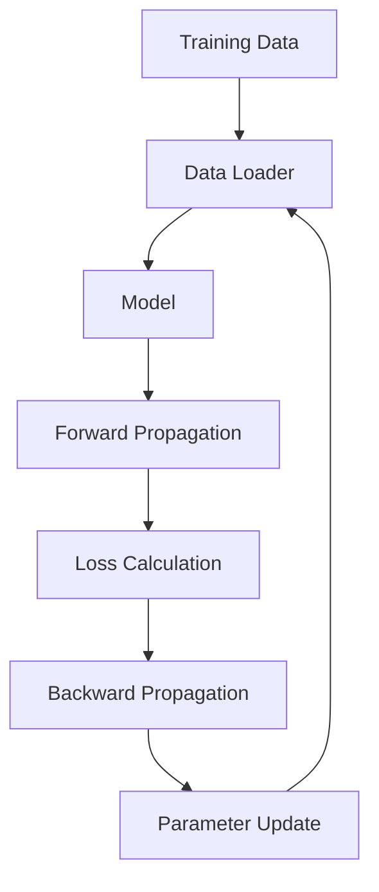
```mermaid
graph TD
    Train[Training Data] --> DataLoader[Data Loader]
    DataLoader --> Model[Model]
    Model --> Forward[Forward Propagation]
    Forward --> Loss[Loss Calculation]
    Loss --> Backward[Backward Propagation]
    Backward --> Update[Parameter Update]
    Update --> DataLoader
```

### 半监督学习数据流

```mermaid
flowchart TD
    LabeledData[有标签数据] --> LB[标签批处理]
    UnlabeledData[无标签数据] --> ULB[无标签批处理]
    LB --> Model[模型]
    ULB --> Model
    Model --> SupervisedLoss[监督损失]
    Model --> UnsupervisedLoss[无监督约束损失]
```

### Semi-supervised Learning Data Flow (English)

```mermaid
graph TD
    LabeledData[Labeled Data] --> LB[Labeled Batch]
    UnlabeledData[Unlabeled Data] --> ULB[Unlabeled Batch]
    LB --> Model[Model]
    ULB --> Model
    Model --> SupervisedLoss[Supervised Loss]
    Model --> UnsupervisedLoss[Unsupervised Constraint Loss]
```

## 约束满足问题解决方法

```mermaid
graph TD
    CSP[约束满足问题] --> |传统方法| Search[搜索算法]
    CSP --> |神经方法| Learning[神经网络学习]
    Learning --> EndToEnd[端到端学习]
    Learning --> ConstraintLearning[约束学习]
    ConstraintLearning --> STE[Straight-Through Estimator]
    ConstraintLearning --> Differentiable[可微分约束]
```

### Constraint Satisfaction Problem Solving Methods (English)

```mermaid
graph TD
    CSP[Constraint Satisfaction Problem] --> |Traditional Methods| Search[Search Algorithms]
    CSP --> |Neural Methods| Learning[Neural Network Learning]
    Learning --> EndToEnd[End-to-End Learning]
    Learning --> ConstraintLearning[Constraint Learning]
    ConstraintLearning --> STE[Straight-Through Estimator]
    ConstraintLearning --> Differentiable[Differentiable Constraints]
```

## 约束损失函数

### 数独约束

```mermaid
graph TD
    P[预测概率] --> Row[行约束]
    P --> Col[列约束]
    P --> Box[3x3盒约束]
    Row --> Uniqueness[唯一性约束]
    Col --> Uniqueness
    Box --> Uniqueness
    Row --> Existence[存在性约束]
    Col --> Existence
    Box --> Existence
    Uniqueness --> Reg[正则化项]
    Existence --> Reg
```

### Sudoku Constraints (English)

```mermaid
graph TD
    P[Prediction Probabilities] --> Row[Row Constraints]
    P --> Col[Column Constraints]
    P --> Box[3x3 Box Constraints]
    Row --> Uniqueness[Uniqueness Constraints]
    Col --> Uniqueness
    Box --> Uniqueness
    Row --> Existence[Existence Constraints]
    Col --> Existence
    Box --> Existence
    Uniqueness --> Reg[Regularization Term]
    Existence --> Reg
```

### 数独约束矩阵表示

```mermaid
graph TD
    Probs["概率分布 (batch_size, 81, 9)"] --> Reshape["重塑为 (batch_size, 9, 9, 9)"]
    Reshape --> RowSum["行求和约束"]
    Reshape --> ColSum["列求和约束"]
    Reshape --> BoxSum["3x3盒求和约束"]
    RowSum --> Cardinality["基数约束(Sum=1)"]
    ColSum --> Cardinality
    BoxSum --> Cardinality
```

### Sudoku Constraint Matrix Representation (English)

```mermaid
graph TD
    Probs["Probability Distribution (batch_size, 81, 9)"] --> Reshape["Reshape to (batch_size, 9, 9, 9)"]
    Reshape --> RowSum["Row Sum Constraint"]
    Reshape --> ColSum["Column Sum Constraint"]
    Reshape --> BoxSum["3x3 Box Sum Constraint"]
    RowSum --> Cardinality["Cardinality Constraint (Sum=1)"]
    ColSum --> Cardinality
    BoxSum --> Cardinality
```

### 注意力约束

```mermaid
graph TD
    A[注意力矩阵] --> SoftMax[Softmax]
    SoftMax --> |相关单元格间建立关系|Mask[掩码过滤]
    Mask --> Sum[加和]
    Sum --> Card[基数约束为1]
```

### Attention Constraints (English)

```mermaid
graph TD
    A[Attention Matrix] --> SoftMax[Softmax]
    SoftMax --> |Establish relationships between related cells|Mask[Mask Filtering]
    Mask --> Sum[Summation]
    Sum --> Card[Cardinality Constraint = 1]
```

### 注意力矩阵的约束实现

```mermaid
flowchart TD
    A["注意力矩阵 (batch*heads, 81, 81)"] --> AdjacentMatrix["邻接矩阵A_adj (81, 81)"]
    A --> |乘法| Masked["掩码注意力"]
    AdjacentMatrix --> Masked
    Masked --> |每行求和| RowSum["行和 (batch*heads, 81, 1)"]
    RowSum --> RegCard["reg_cardinality(RowSum, 1)"]
```

### Attention Matrix Constraint Implementation (English)

```mermaid
graph TD
    A["Attention Matrix (batch*heads, 81, 81)"] --> AdjacentMatrix["Adjacency Matrix A_adj (81, 81)"]
    A --> |Multiplication| Masked["Masked Attention"]
    AdjacentMatrix --> Masked
    Masked --> |Sum each row| RowSum["Row Sum (batch*heads, 81, 1)"]
    RowSum --> RegCard["reg_cardinality(RowSum, 1)"]
```

## 训练流程

```mermaid
sequenceDiagram
    participant D as 数据集
    participant M as 模型
    participant L as 损失函数
    participant O as 优化器
    
    D->>M: 批次数据
    M->>M: 前向传播(递归Transformer)
    M->>L: 计算交叉熵损失
    M->>L: 计算约束损失
    L->>O: 总损失
    O->>M: 更新参数
```

### Training Process (English)

```mermaid
sequenceDiagram
    participant D as Dataset
    participant M as Model
    participant L as Loss Functions
    participant O as Optimizer
    
    D->>M: Batch Data
    M->>M: Forward Pass (Recurrent Transformer)
    M->>L: Calculate Cross Entropy Loss
    M->>L: Calculate Constraint Loss
    L->>O: Total Loss
    O->>M: Update Parameters
```

## 实验流程

```mermaid
graph TD
    Setup[实验设置] --> Train[训练模型]
    Train --> Eval[评估模型]
    Eval --> Log[记录结果]
    Log --> Visualization[可视化]
```

### Experiment Process (English)

```mermaid
graph TD
    Setup[Experiment Setup] --> Train[Train Model]
    Train --> Eval[Evaluate Model]
    Eval --> Log[Log Results]
    Log --> Visualization[Visualization]
```

## 模型评估

```mermaid
flowchart TD
    TestData[测试数据] --> Model[模型]
    Model --> Output[输出预测]
    Output --> Metrics[评估指标]
    Metrics --> BoardAcc[棋盘准确率]
    Metrics --> CellAcc[单元格准确率]
```

### Model Evaluation (English)

```mermaid
graph TD
    TestData[Test Data] --> Model[Model]
    Model --> Output[Output Predictions]
    Output --> Metrics[Evaluation Metrics]
    Metrics --> BoardAcc[Board Accuracy]
    Metrics --> CellAcc[Cell Accuracy]
```

## 模型评估详细流程

```mermaid
flowchart TD
    TestDataset[测试数据集] --> TestLoader[测试数据加载器]
    TestLoader --> TestNN[testNN函数]
    TestLoader --> TestNNTrick[testNN_trick函数]
    TestNN --> Eval[模型评估]
    TestNNTrick --> Eval
    Eval --> BoardAccuracy[棋盘准确率]
    Eval --> CellAccuracy[单元格准确率]
    Eval --> VisualizeMaps[可视化注意力图]
```

### Detailed Model Evaluation Process (English)

```mermaid
graph TD
    TestDataset[Test Dataset] --> TestLoader[Test Data Loader]
    TestLoader --> TestNN[testNN Function]
    TestLoader --> TestNNTrick[testNN_trick Function]
    TestNN --> Eval[Model Evaluation]
    TestNNTrick --> Eval
    Eval --> BoardAccuracy[Board Accuracy]
    Eval --> CellAccuracy[Cell Accuracy]
    Eval --> VisualizeMaps[Visualize Attention Maps]
```

## 模型组件关系

```mermaid
classDiagram
    class GPTConfig {
        +vocab_size
        +block_size
        +causal_mask
        +losses
        +n_recur
    }
    
    class GPT {
        +tok_emb
        +pos_emb
        +blocks
        +ln_f
        +head
        +forward()
    }
    
    class Block {
        +ln1
        +ln2
        +attn
        +mlp
        +forward()
    }
    
    class CausalSelfAttention {
        +key
        +query
        +value
        +proj
        +forward()
    }
    
    class Trainer {
        +model
        +train_dataset
        +test_dataset
        +config
        +train()
    }
    
    GPTConfig <|-- GPT
    GPT *-- Block
    Block *-- CausalSelfAttention
    Trainer o-- GPT
```

### Model Component Relationships (English)

```mermaid
classDiagram
    class GPTConfig {
        +vocab_size
        +block_size
        +causal_mask
        +losses
        +n_recur
    }
    
    class GPT {
        +tok_emb
        +pos_emb
        +blocks
        +ln_f
        +head
        +forward()
    }
    
    class Block {
        +ln1
        +ln2
        +attn
        +mlp
        +forward()
    }
    
    class CausalSelfAttention {
        +key
        +query
        +value
        +proj
        +forward()
    }
    
    class Trainer {
        +model
        +train_dataset
        +test_dataset
        +config
        +train()
    }
    
    GPTConfig <|-- GPT
    GPT *-- Block
    Block *-- CausalSelfAttention
    Trainer o-- GPT
```

## 递归和约束协同关系

```mermaid
graph TD
    Recursion[递归机制] --> Refinement[问题求解逐步精化]
    Constraints[约束机制] --> Structure[问题结构先验]
    Refinement --> Learning[端到端学习]
    Structure --> Learning
    Learning --> Solution[问题解决方案]
```

### Recursion and Constraint Collaboration (English)

```mermaid
graph TD
    Recursion[Recursion Mechanism] --> Refinement[Problem Solving Iterative Refinement]
    Constraints[Constraint Mechanism] --> Structure[Problem Structure Prior]
    Refinement --> Learning[End-to-End Learning]
    Structure --> Learning
    Learning --> Solution[Problem Solution]
```

## 推理过程

```mermaid
flowchart TD
    Input[输入不完整数据] --> Model[模型]
    Model --> Predict[预测]
    Predict --> |置信度最高的空格| Fill[填充一个格子]
    Fill --> |仍有空格| Model
    Fill --> |所有格子已填| Complete[完成]
```

### Inference Process (English)

```mermaid
graph TD
    Input[Incomplete Input Data] --> Model[Model]
    Model --> Predict[Prediction]
    Predict --> |Highest confidence cell| Fill[Fill One Cell]
    Fill --> |Empty cells remain| Model
    Fill --> |All cells filled| Complete[Complete]
```

## 推理算法细节

```mermaid
flowchart TD
    Input["输入X (batch_size, 81)"] --> Clone["克隆X"]
    Clone --> Loop["循环直到所有格子填满"]
    Loop --> ModelPred["模型预测 (batch_size, 81, 9)"]
    ModelPred --> Probs["转换为概率"]
    Probs --> MaskFilled["掩码已填充格子"]
    MaskFilled --> FindMax["找出最大概率位置"]
    FindMax --> FillPosition["填充该位置"]
    FillPosition --> |仍有空格| Loop
    FillPosition --> |无空格| Output["输出完整解"]
```

### Inference Algorithm Details (English)

```mermaid
graph TD
    Input["Input X (batch_size, 81)"] --> Clone["Clone X"]
    Clone --> Loop["Loop until all cells filled"]
    Loop --> ModelPred["Model Prediction (batch_size, 81, 9)"]
    ModelPred --> Probs["Convert to Probabilities"]
    Probs --> MaskFilled["Mask Filled Cells"]
    MaskFilled --> FindMax["Find Max Probability Position"]
    FindMax --> FillPosition["Fill Position"]
    FillPosition --> |Empty cells remain| Loop
    FillPosition --> |No empty cells| Output["Output Complete Solution"]
```
